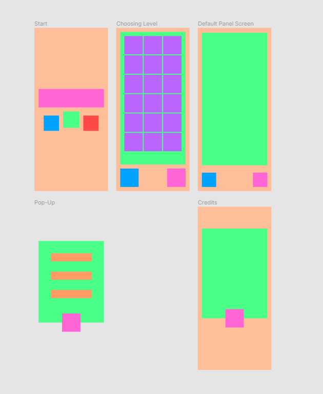

# What is *Cats Dreams*?

*Cats Dreams* is a simple 2D mobile Memory, Matching Pairs, Pairs or Match Up (it depends how you commonly call it) game. It is my first Unity project, created while I was beginning to learn how to work with the engine. My purpose was to learn how to implement and optimize User Interfaces (UIs) in Unity. That’s why I choose to create a memory game in the first place: I could focus on using Unity’s UI toolkit, manipulating the Canvas and even adding some music and sound effects to the interface while creating the logic of the game.

  

# Designing the game

After deciding what kind of game I would create, it was time to start to think about the game screen’s flow and structure. So, I created a project on Figma to draw screen’s compositions and organization, aside from a flowchart of the application.

 

First image shows drafts of screens that I would like to implement in the first moment. After drawing them, I made a prototype with them to create a flow. If it’s interest, you can check both of prototype — [click here](https://www.figma.com/proto/qCdbdzrhdQP1KI6Cm32NZ1/screens_and_prototype?node-id=4%3A18&scaling=scale-down&page-id=0%3A1&starting-point-node-id=4%3A18) — and flowchart (shown in the second image) — [click here](https://www.figma.com/file/3jGtpWtK4LjPtJkJcOiIlB/memory_game_flow?node-id=0%3A1).

I wanted to create as little as screens that I could to make it the simplest possible. In the end, there is a total of 3 screens (and scenes) and 3 pop-ups. 

## Screens

First one has the logo and three buttons (settings, play and credits); second has a kind of scrollable map with avaiable levels; and three has the game itself, with tiles to match. The last two has two buttons: one to return to the main screen and another one to open the settings pop-up.

Second and third screens are almost entirely instantiated in the runtime.

## Pop-ups

There are three possible pop-ups: to settings, to credits and one that shows user’s result in that level. Setting’s pop-up contains two toggle buttons to enable and disable music and SFX, besides a dropdown to choose a language (which is something that I haven’t implemented yet but is still in my planning). Credits one just have the message *“Game developed by Yasmin Rivera”* and a button to open my instagram profile. Finally, result’s (or *end game pop-up* called by me) pop-up show how much stars the player got and options to restart the level, go back to the map level or go to the next level (if it’s possible).

  

# Describing the logic behind the game

The idea of the game is pretty simple: you have to match two equal tiles until there’s no tiles left.

Every time a player starts a level, it creates a random arrangement. So it’s not possible to memorize tile’s positions for a any level. Furthermore, you need to achieve at least 1 star (it can change in more complex or hard levels) to be able to play the next. If you haven’t achived, the button to go to the next level, in the end game pop-up, won’t be avaiable and it will be necessary to play the same level again.

It was used Unity’s PlayerPrefs system to save user’s progress and be able to show how much stars the player got in a level on the levels map screen, among other things.

# Visual and Sound Assets Reference

I hadn’t created any of the visual or sound assets of this project. All of them are free to use and avaiable on Unity Asset Store. Just for curiosity, those are links to some bundles that I used in this project:

- ****[Match 3 - Pets Sprite Mega Pack](https://assetstore.unity.com/packages/2d/environments/match-3-pets-sprite-mega-pack-73033)****
- ****[Puzzle stage & settings GUI Pack](https://assetstore.unity.com/packages/2d/gui/puzzle-stage-settings-gui-pack-147389#description)****

I’m still looking for others cause I lost them. I’ll update here when I find them.

## Animations

Every animation inside the game was created using DOTWeen plugin.
